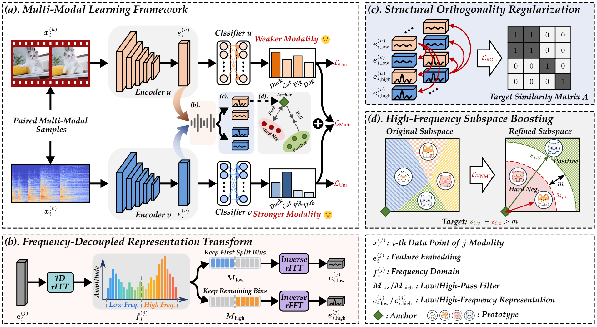

# Rebalancing Multi-Modal Learning via Frequency-Decoupled Discriminative Structure Enhancement
This repo is the official implementation of _Rebalancing Multi-Modal Learning via Frequency-Decoupled Discriminative Structure Enhancement_. 

## Framework


## Data Preparation
* Download the CREMA-D dataset from this link: https://github.com/CheyneyComputerScience/CREMA-D
* Download the Kinetics-Sounds dataset from this link: https://github.com/cvdfoundation/kinetics-dataset
* Download the Sarcasm dataset from this link: https://github.com/feiLinX/Multi-modal-Sarcasm-Detection
* Download the Twitter15 dataset from this link: https://github.com/jefferyYu/TomBERT
* Download the NVGresutre dataset from this link: https://research.nvidia.com/publication/2016-06_online-detection-and-classification-dynamic-hand-gestures-recurrent-3d

The directory organization of the final data file should be as follows (task CREMA-D as an example):
```
├── CREMAD/
│   ├── annotations/
│	│	├── train.csv
│	│	├── test.csv
│   ├── AudioWAV/
│	│	├── 1001_DFA_ANG_XX.wav
│	│	├── 1001_DFA_DIS_XX.wav
│	│	├── ...
│   ├── Image-01-FPS/
│	│	├── 1001_DFA_ANG_XX
│	│	├── 1001_DFA_DIS_XX
│	│	├── ...
│   ├── Image-01-FPS-SE/
│   ├── wav_pkl/
│	│	├── 1001_DFA_ANG_XX.pkl
│	│	├── 1001_DFA_DIS_XX.pkl
│   ├── sound_preprocessing.py
```

### Training & Evaluation
Run the following command to train the model and evaluate the results (take Kinetics-Sounds as an example):
```shell

python train_KS.py

```
